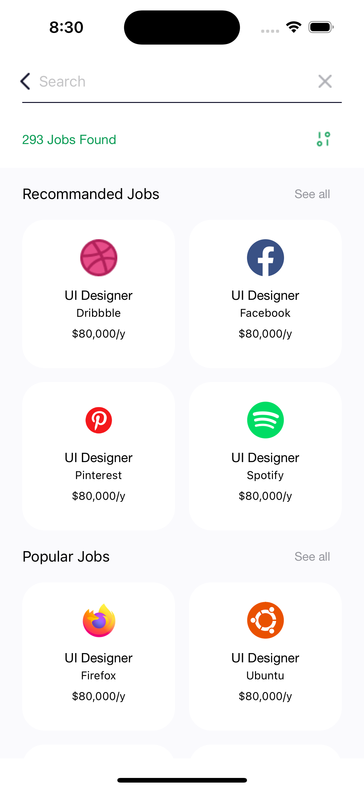
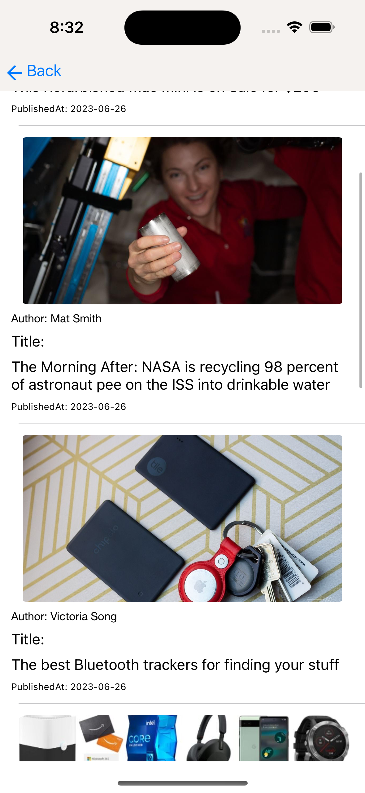

# iOS 

- Xcode - 14.2
- Swift - 5.7.3

### Swift Basic
- Variable
- String and Characters
- Control Flow [for, while, repeat...while]
- Collections [array, ,set, dictionary, tuple]
- Optionals 
- Forced Unwrapped
- if let and guard let

### Advanced Swift

- Function
- Closure
- Struct and Class
- Enum
- Methods And properties
- Subscript
- Inheritance
- Initialization & Deinitialization
- Optional chaining
- Error handling
- Type casting & Nested Type
- ARC
- Extension 
- Protocol
- Access specifiers

### Basic Auto Layout

- Basic of AutoLayout
- Constraints
- Minumum required onstraints
- Types of Constraints
    - Leading, Trailing
    - Top, Bottom
    - Height, Width
    - Center vertical, Center horizontal

### Advanced Auto Layout

- Hugging priority
- compression Resistance
- Size Classes

### UI-Components

- UILabel
- UIButton
- UITextField
- UITextView
- UISwitch
- UISlider
- UIProgressView
- UISegmentedControl
- UIPageControl
- UIStepper
- UIScrollView
- UITableView
- UICollectionView
- Pull to refresh
- UIImageView
- Image Picker
- UIActivityIndicator
- WKWebView
- UISearchBar
- Stack view
- UITabBar
- UIToolBar
- UIBarButtons
- UIPickerView
- UIDatePicker
- CLLocation
- UIMapView

### UI-Navigation
#### UI-Navigation Controller
- Navigation using Segue
    - Types of Segue
    - Data passing using Segue
    - Set root controller
- Navigation using Programmetically
    - push, pop, present and dissmiss viewcontroller
    - Set root viewcontroller
    
#### UI-Navigation Bar
- Change title of NavigationBar
- Change Back Button title and image
- add BarButtonItems in Navigation Bar

### Reverse KT-Screen
| Sign Up | Sign Up | Interest |
| :--: | :-----: | :---: |
|  |  |  |

### TableView
| Expand Cell | Light | Dark |
| :--: | :-----: | :---: |
|  |  |  |

### CollectionView
| Light | Dark | Chat |
| :--: | :-----: | :---: |
|  |  |  |

### MapView
| Light | Dark | 
| :--: | :-----: | 
|  |  | 

### News App
| Home | Details | 
| :--: | :-----: | 
|  |  | 
